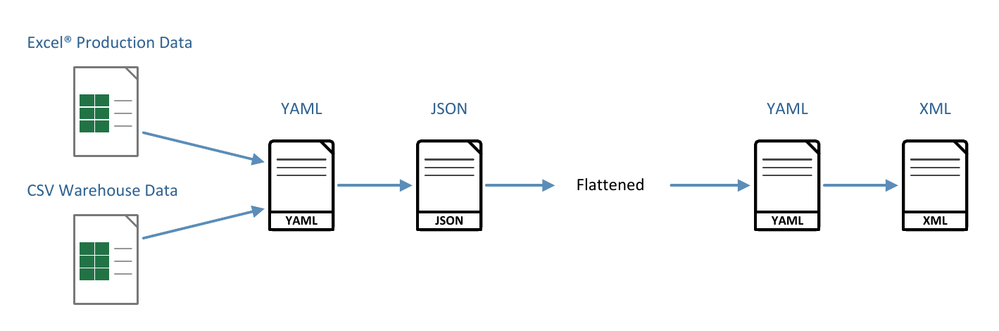
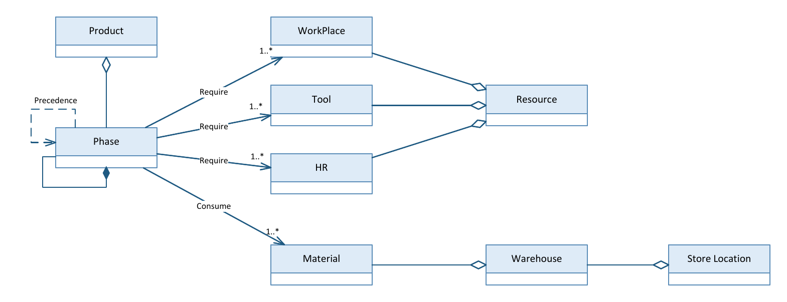

# DTconnector

**A lightweight, configuration-driven pipeline that turns ordinary enterprise-system exports into simulation-ready input for a Digital Twin.**

DTconnector takes the files a manufacturer already produces (a production spreadsheet from ERP/MES and a stock export from the WMS), harmonises them into one canonical schema, and writes the XML feeds that a discrete-event simulation model imports directly. It needs no new sensors, no middleware and no changes to the source systems. Adapting it to a new plant means editing two YAML files, not the code.

It is the Integration Layer of the three-layer Digital Twin architecture presented in:

> L. Ragazzini, E. Negri, M. Macchi. *Low-Cost Production–Logistics Data Integration for Digital Twin-based Lead-Time Prediction in MTO/ATO Manufacturing.* Submitted to the *International Journal of Computer Integrated Manufacturing*.

---

## How it works



| Stage | What happens | Script |
|---|---|---|
| **Extract** | Production data (task hierarchy, processing times, skills, precedences, materials) are read from a spreadsheet export; warehouse data (stock and storage locations) from a CSV export. | `excel_to_json_parser.py`, `warehouse_csv_to_json_parser.py` |
| **Transform** | Column names are mapped onto the canonical schema through `to_json_config.yaml`, including regular expressions that absorb naming variants across departments. The task hierarchy is then **flattened** to executable leaf tasks, which inherit skills, materials and parent references from their parent levels. | `excel_to_json_parser.py`, `flatten_tasks.py` |
| **Load** | Keys and values are mapped onto the simulation objects through `to_xml_config.yaml` and serialised as `PlantSimulationTable` XML, one feed for production and one for the warehouse. | `json_to_xml_with_config.py` |

The only engine-specific step is the final JSON-to-XML serialisation. Everything upstream works on the canonical schema and is unaffected by the choice of simulation engine.

## Data model

The canonical schema follows ISA-95 semantics and couples production and logistics: a phase requires workplaces, tools and human resources, and consumes materials that are located in the warehouse.



## Quick start

```bash
pip install -r requirements.txt

python run_pipeline.py --production examples/production_example.xlsx \
                       --warehouse  examples/warehouse_example.csv \
                       --out output
```

This writes to `output/`:

| File | Content |
|---|---|
| `production.json` | Task hierarchy in the canonical schema |
| `production_flattened.json` | Leaf tasks only, with inherited skills and materials |
| `production.xml` | Production feed for the simulation model |
| `warehouse.json` | Stock records |
| `warehouse.xml` | Warehouse feed for the simulation model |

The same outputs, generated from the example data, are committed in [`examples/output/`](examples/output).

Each script can also be run on its own:

```bash
cd pipeline
python excel_to_json_parser.py         ../examples/production_example.xlsx production.json
python flatten_tasks.py                production.json production_flattened.json
python warehouse_csv_to_json_parser.py ../examples/warehouse_example.csv warehouse.json
python json_to_xml_with_config.py      production_flattened.json production.xml
python json_to_xml_with_config.py      warehouse.json warehouse.xml
```

## Input formats

**Production spreadsheet** (one row per task, hierarchy given by the outline level):

| Column | Meaning |
|---|---|
| `Outline Level` | 1 = product (machine type), 2, 3, … = phases and sub-tasks |
| `Name` | Task name |
| `Duration` | Processing time, in seconds |
| `Resource Names` | Required skill group(s), comma separated |
| `Predecessors` | Tasks that must be complete first, comma separated |
| `Materials` | Material codes consumed, comma separated |

Differently named columns (for example `Task Name`, `Processing Time`, `Role`, `Items`) are recognised through the rules in `to_json_config.yaml`.

**Warehouse CSV** (one row per stock record): `Code`, `Area`, `Shelf Unit`, `Shelf Level`, `Quantity`, plus the optional yes/no flags `Available` and `Inbound`.

## Configuration

All site-specific knowledge lives in two YAML files in `pipeline/`:

- **`to_json_config.yaml`** maps spreadsheet columns onto schema fields (`direct`) and catches naming variants with regular expressions (`patterns`).
- **`to_xml_config.yaml`** controls the XML side:
  - `key_mapping` renames fields (for example `processingTime` to `procTime`, with a snake_case to camelCase rule and a fallback that keeps unknown keys);
  - `value_mapping` maps several source spellings of the same component onto one simulation object (for example `ComponentA` and `CompA` both resolve to the same part);
  - `predefined_data` sets default task-status flags;
  - `product_mu` and `warehouse` set how products and stock records are named in the simulation and which fields hold the storage coordinates.

```yaml
# to_xml_config.yaml (excerpt)
value_mapping:
  aliases:
    - sources: ["ComponentA", "CompA"]
      target: ".UserObjects.Parts.PartA"
warehouse:
  code_field: "Code"
  quantity_field: "Quantity"
  attributes: ["Area", "Shelf Unit", "Shelf Level"]
```

## Repository structure

```
DTconnector/
├── run_pipeline.py            one-command runner
├── pipeline/                  the integration pipeline
│   ├── excel_to_json_parser.py
│   ├── flatten_tasks.py
│   ├── warehouse_csv_to_json_parser.py
│   ├── json_to_xml_with_config.py
│   ├── to_json_config.yaml
│   └── to_xml_config.yaml
├── examples/                  synthetic input data and the outputs it produces
└── docs/                      figures
```

## Notes on this release

- **The example data are synthetic.** The industrial data of the case study are confidential and are not included.
- **Development history.** The pipeline was developed at Politecnico di Milano within the MSc thesis of Matilde Palladini and Ludovica Savoini. This public release was completed and consolidated in September 2026. The warehouse XML writer, the configuration-driven column mapping, the product naming in the production feed and the one-command runner were added or completed at that stage, and are covered by the example.
- **Scope.** The Plant Simulation model that consumes the XML feeds is not part of this repository.

## License

Copyright (C) 2025-2026 the DTconnector authors, Politecnico di Milano.

DTconnector is free software, released under the [GNU General Public License v3.0](LICENSE). You may use, study, modify and share it, including for commercial purposes; if you distribute a modified version, it must be released under the same license, with its source code. The software comes with no warranty.

## Authors

Lorenzo Ragazzini, Elisa Negri, Marco Macchi. Department of Management, Economics and Industrial Engineering, Politecnico di Milano.

Contact: elisa.negri@polimi.it
